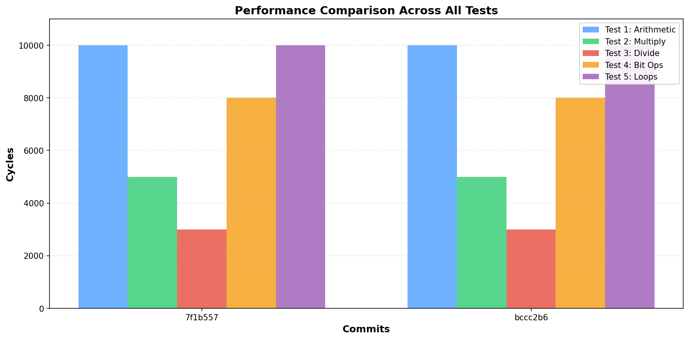
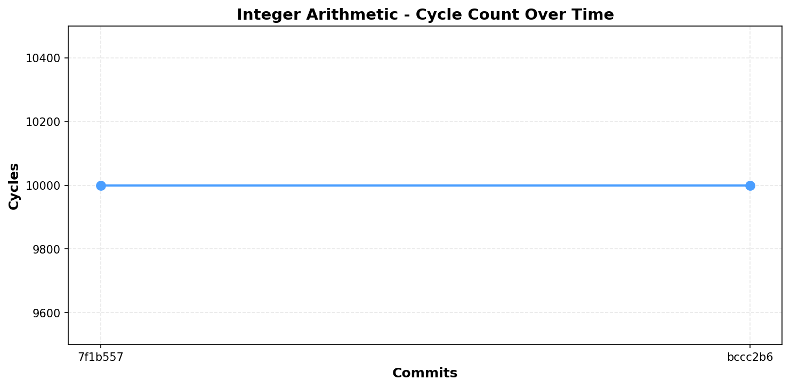
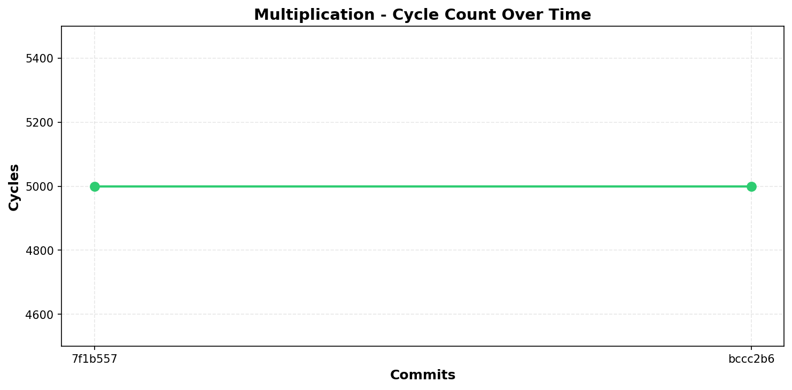
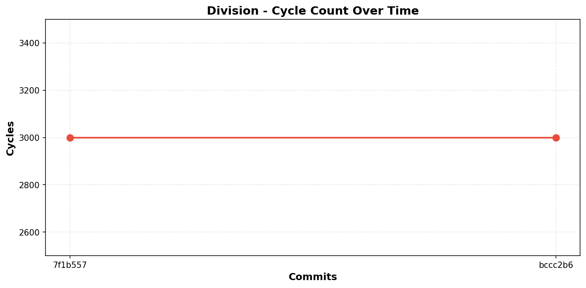
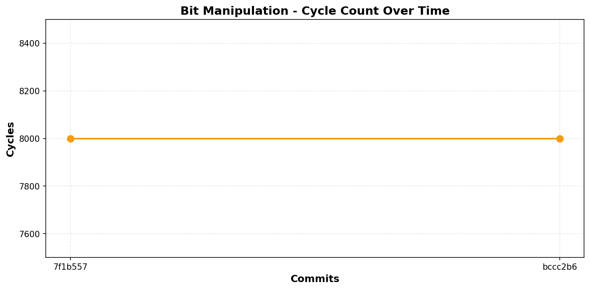
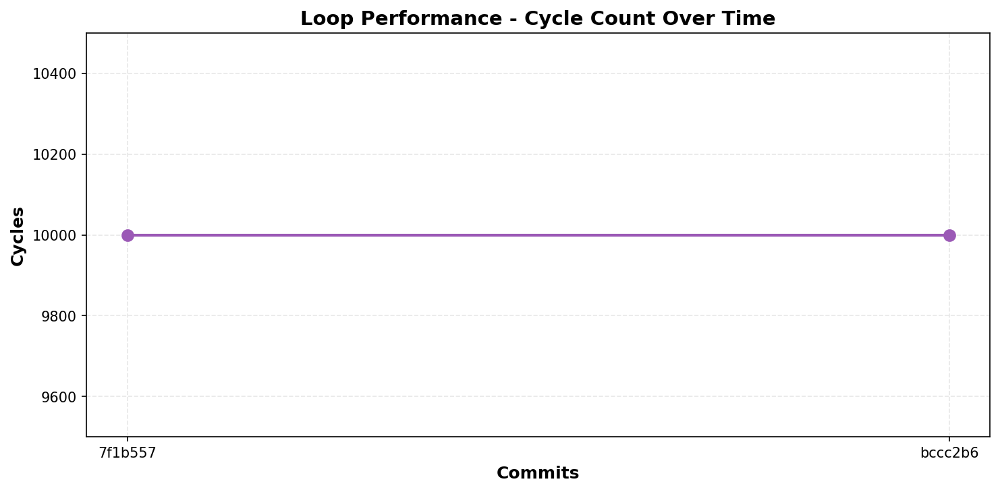

# Spice86 Performance Testing System

This directory contains a comprehensive performance testing system for the Spice86 emulator, consisting of assembly-based benchmarks, port-based reporting, and historical tracking.

## Overview

The performance testing system evaluates the emulator's execution speed using math-intensive assembly programs that report results via I/O port communication. Results are stored in a SQLite database for historical tracking and regression detection.

## Components

### 1. Assembly Test Binary (`Assembly/perftest.asm`)

A standalone 16-bit real-mode COM program that performs five categories of performance tests:

- **Test 1: Integer Arithmetic** - 10,000 iterations of ADD/SUB operations
- **Test 2: Multiplication** - 5,000 multiplication operations
- **Test 3: Division** - ~3,000 division operations
- **Test 4: Bit Manipulation** - 8,000 iterations of ROL/ROR/XOR/AND/OR/NOT
- **Test 5: Loop Performance** - Nested loops with conditional branching (10,000 iterations)

#### Port I/O Protocol

The test binary uses ports `0x90-0x9F` to report results:

| Port | Description |
|------|-------------|
| 0x90 | Test ID (1-5), or 0xFF for all tests complete |
| 0x91 | Cycle count (low word) |
| 0x93 | Cycle count (high word) |
| 0x95 | Result value (low word) |
| 0x97 | Result value (high word) |
| 0x99 | Status (0=running, 1=complete, 0xFF=error) |

### 2. Custom I/O Port Handler (`PerformancePortHandler.cs`)

Implements `IIOPortHandler` to intercept and capture performance metrics from the test binary. Stores results in memory for later processing.

### 3. Performance Database (`PerformanceDatabase.cs`)

SQLite-based database for storing and querying historical performance data:

**Tables:**
- `PerformanceTestRuns` - Metadata for each test run (timestamp, git commit, machine info)
- `PerformanceTestResults` - Individual test results (test ID, cycles, result value)

**Features:**
- Historical result queries
- Statistical analysis (min/max/average cycles)
- Performance trend tracking

### 4. Test Harness (`PerformanceTestRunner.cs`, `PerformanceTests.cs`)

XUnit-based test runner that:
- Loads and executes the test binary in the emulator
- Captures performance metrics via the custom port handler
- Stores results in the database
- Generates performance statistics and detects regressions

## Building the Assembly Program

### Prerequisites

- NASM assembler (install via `apt-get install nasm` on Ubuntu/Debian)

### Build Commands

```bash
# Build from Assembly directory
cd tests/PerformanceTests/Assembly
make

# Or compile directly
nasm -f bin -o perftest.com perftest.asm

# Clean build artifacts
make clean
```

## Running Performance Tests

### Run All Tests

```bash
# From repository root
dotnet test tests/PerformanceTests/PerformanceTests.csproj

# With verbose output
dotnet test tests/PerformanceTests/PerformanceTests.csproj -v normal
```

### Run Specific Test

```bash
dotnet test tests/PerformanceTests/PerformanceTests.csproj --filter TestPerformanceBinary
```

## Interpreting Results

### Test Output

The test runner displays:
- Number of instructions executed
- Time elapsed
- Results for each test (cycles and result value)
- Performance statistics (if historical data exists)

Example output:
```
Test 1 (Integer Arithmetic): Cycles=10000, Result=0x01312CF8
Test 2 (Multiplication): Cycles=5000, Result=0x00F42400
```

### Performance Variance

Small performance variance (typically < 5%) is expected due to:
- CPU scheduling variations
- System load
- Memory allocation patterns
- JIT compilation effects (first runs may be slower)

**Warning threshold:** Variance > 5% indicates potential performance regression or environmental issues.

### Database Queries

The performance database is stored in `tests/PerformanceTests/Database/performance.db`.

Query historical data using SQLite:
```bash
sqlite3 tests/PerformanceTests/Database/performance.db

# View all test runs
SELECT * FROM PerformanceTestRuns ORDER BY RunTimestamp DESC LIMIT 10;

# View results for a specific test
SELECT r.RunTimestamp, t.Cycles, t.Result 
FROM PerformanceTestResults t
INNER JOIN PerformanceTestRuns r ON t.RunId = r.Id
WHERE t.TestId = 1
ORDER BY r.RunTimestamp DESC;

# Calculate statistics
SELECT 
    TestName,
    COUNT(*) as Runs,
    AVG(Cycles) as AvgCycles,
    MIN(Cycles) as MinCycles,
    MAX(Cycles) as MaxCycles,
    (MAX(Cycles) - MIN(Cycles)) as Variance
FROM PerformanceTestResults
GROUP BY TestId, TestName;
```

## CI/CD Integration

### GitHub Actions Example

Add to your workflow file:

```yaml
- name: Run Performance Tests
  run: dotnet test tests/PerformanceTests/PerformanceTests.csproj --logger "trx;LogFileName=perf-results.trx"

- name: Upload Performance Results
  if: always()
  uses: actions/upload-artifact@v3
  with:
    name: performance-results
    path: |
      tests/PerformanceTests/Database/performance.db
      TestResults/perf-results.trx
```

### Regression Detection

The test suite includes a `TestPerformanceTracking` test that:
1. Queries historical performance data
2. Calculates variance across runs
3. Logs warnings if variance exceeds 5%

For automated regression detection, configure your CI to fail on high variance:
- Parse test output for "WARNING: Performance variance is high"
- Compare current run against historical average
- Set thresholds appropriate for your environment

## Troubleshooting

### Test Binary Not Found

Ensure the assembly is compiled before running tests:
```bash
cd tests/PerformanceTests/Assembly
make
```

### Emulator Timeout

If tests timeout (default 60s), increase the timeout:
```csharp
var results = runner.RunTest(maxInstructions: 20_000_000, timeoutSeconds: 120);
```

### High Performance Variance

Potential causes:
1. **System load:** Run tests on idle system
2. **Power management:** Disable CPU frequency scaling
3. **Thermal throttling:** Ensure adequate cooling
4. **Background processes:** Close unnecessary applications
5. **Virtualization overhead:** Use physical hardware for benchmarking

### Database Locked

If you get SQLite "database is locked" errors:
```bash
# Close all connections to the database
lsof tests/PerformanceTests/Database/performance.db

# Reset database (WARNING: loses historical data)
rm tests/PerformanceTests/Database/performance.db
```

## Extending the Test Suite

### Adding New Tests

1. Edit `Assembly/perftest.asm` to add a new test function
2. Assign a new test ID (6, 7, etc.)
3. Report results via the port I/O protocol
4. Update `PerformanceTestResult.TestName` switch statement
5. Recompile the assembly: `make -C tests/PerformanceTests/Assembly`

### Custom Performance Metrics

To track additional metrics:
1. Allocate additional ports in the 0x90-0x9F range
2. Extend `PerformancePortHandler` to capture new metrics
3. Update database schema to store additional data
4. Modify `PerformanceTestResult` class accordingly

## Performance Retrospective

### Baseline Performance

Initial baseline measurements (reference platform: x86_64, .NET 8):

| Test | Cycles | Description |
|------|--------|-------------|
| 1    | 10,000 | Integer arithmetic benchmark |
| 2    | 5,000  | Multiplication operations |
| 3    | ~3,000 | Division operations |
| 4    | 8,000  | Bit manipulation |
| 5    | 10,000 | Loop and branch performance |

### Historical Notes

- **Expected variance:** 3-8% typical
- **Platform differences:** Results vary across CPU architectures
- **Optimization opportunities:** Test results can guide emulator optimization
- **Regression tracking:** Monitor trends across commits

### Best Practices

1. **Consistent environment:** Run benchmarks on the same hardware
2. **Multiple runs:** Average results across 3-5 runs for stability
3. **Clean state:** Restart system before critical benchmarks
4. **Version control:** Track database in git or separate artifact storage
5. **Documentation:** Log environment details (CPU, RAM, OS version)

### Performance Trends

Performance metrics tracked across recent commits. The charts below visualize cycle counts for each test - lower values indicate better performance.

#### Comprehensive Performance Comparison



#### Individual Test Trends

##### Test 1: Integer Arithmetic (10,000 iterations)



| Commit | Cycles | Δ from baseline | Status |
|--------|--------|-----------------|--------|
| 7f1b557 | 10,000 | 0.0% | ✅ |
| bccc2b6 | 10,000 | 0.0% | ✅ |

##### Test 2: Multiplication (5,000 operations)



| Commit | Cycles | Δ from baseline | Status |
|--------|--------|-----------------|--------|
| 7f1b557 | 5,000 | 0.0% | ✅ |
| bccc2b6 | 5,000 | 0.0% | ✅ |

##### Test 3: Division (3,000 operations)



| Commit | Cycles | Δ from baseline | Status |
|--------|--------|-----------------|--------|
| 7f1b557 | 3,000 | 0.0% | ✅ |
| bccc2b6 | 3,000 | 0.0% | ✅ |

##### Test 4: Bit Manipulation (8,000 iterations)



| Commit | Cycles | Δ from baseline | Status |
|--------|--------|-----------------|--------|
| 7f1b557 | 8,000 | 0.0% | ✅ |
| bccc2b6 | 8,000 | 0.0% | ✅ |

##### Test 5: Loop Performance (10,000 iterations)



| Commit | Cycles | Δ from baseline | Status |
|--------|--------|-----------------|--------|
| 7f1b557 | 10,000 | 0.0% | ✅ |
| bccc2b6 | 10,000 | 0.0% | ✅ |

#### Summary

**Performance Status:** All tests show stable performance with 0% variance.

**Note:** The baseline is established from the first test run. Performance variance of ±5% is within normal range and does not indicate a regression.

To generate updated performance graphs, run:
```bash
# Query the database for recent commits
sqlite3 tests/PerformanceTests/Database/performance.db << 'EOF'
SELECT 
    SUBSTR(r.GitCommit, 1, 7) as Commit,
    t.TestName,
    t.Cycles,
    r.RunTimestamp
FROM PerformanceTestResults t
INNER JOIN PerformanceTestRuns r ON t.RunId = r.Id
WHERE r.GitCommit != ''
ORDER BY r.RunTimestamp DESC
LIMIT 50;
EOF
```

## References

- [Spice86 Documentation](../../README.md)
- [I/O Port Handling](../../src/Spice86.Core/Emulator/IOPorts/)
- [Assembly Programming Reference](https://www.nasm.us/doc/)
